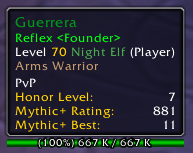
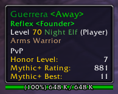
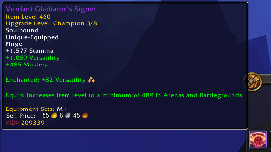
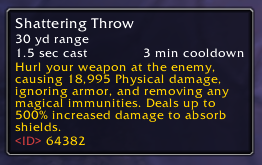
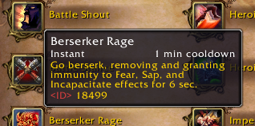
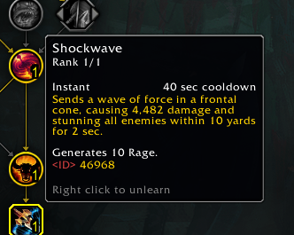
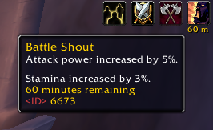
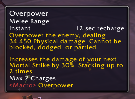
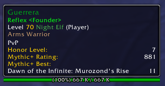

# TooltipInfo

TooltipInfo is a simple and opinionated addon designed to enrich your World of Warcraft experience by enhancing the the standard tooltip with additional information and visuals.

## Features:

- **Anchors:** You can set the anchor to dynamic by typing `/tti anchor dynamic` which adjusts the anchor of the tooltip based on whether it's a unit or a frame:
  - **For Units:** it anchors to the right of the unit.
  - **For Frames:** it anchors to the default position, except in rare cases where the positioning may be adjusted.
  - **To revert the anchor back to normal you can type:** `/tti anchor normal`.

- **Guild:** Display the guild name and character rank.

- **Honor Level:** Display the honor level of players.

- **Item Source:** Display the expansion name for items, indicating when they were introduced.

- **Character Level:** Display the effective/actual level of characters.
  - Can be useful for Timewalking Dungeons

- **Mythic+:** Display Mythic+ rating and best run of characters.

- **Raid Icon:** Display the icon on the tooltip.

- **Target of Target:** Display the target's target for improved awareness.

- **StatusBar:** Display the health of units on the tooltip's StatusBar.

- **Character Race and Class Colors:** Color-coded for improved visuals.

## Additional Features:

### Display Away Status

### Hold Shift to reveal the ID of items

### Hold Shift to reveal the ID of spells

### Hold Shift to reveal the ID of auras

### Hold Shift to display the full name of macros

### Hold Shift to display the name of the Mythic+ dungeon

### Enjoy!
